# 实验名称

图像特征与理解(python实现)

# 实验目的与要求

掌握图像的基本特征算法,理解图像中目标的几何特征、形状特征的物理与几何意义，并能够将特征的数学语言转换成程序描述。掌握图像的角点特征算法,理解Moravec角点、Harris角点及SUSAN角点算法的物理与几何意义，并能够将角点的数学语言转换成程序描述。掌握图像的纹理分析算法,理解空间自相关函数纹理测度算法的几何意义，并能够将角点的数学语言转换成程序描述。了解模板匹配算法原理，并能编程验证。

# 实验内容

1. **角点算法设计与实现（40分）**
   a)	编程实现Harris角点检测效果
   b)	编程实现SUSAN角点检测效果
注：要在实验报告中体现及描述算法的物理与几何意义！
2. **圆形度判断并排序（40分）**
   a)	编程实现圆形度判断并排序
   b)	先二值化原图像，然后提取目标连通区域，最后对目标区域连通度做一个判断并排序，同时输出图像中有多少个细胞

3. **不变矩识别验证码中的数字(20, 可选做为工程实践题目)**

# 实验仪器与设备

联想笔记本电脑。
13代i7处理器，32G内存。
4070显卡。

# 实验原理

## 角点检测

### Harris角点检测

Harris角点检测算法是一种经典的角点检测方法，其基本思想是通过分析图像**局部区域的灰度变化**来判断角点。当图像局部区域在任意方向上都有较大的灰度变化时，这个区域很可能是一个角点。利用**卷积窗口滑动的思想**，窗口在图像上移动，若出现窗口内的像素灰度出现了较大的变化，则该点为角点。

#### 基本原理

Harris角点检测的核心是计算图像局部区域在各个方向上的灰度变化。对于图像中的一个点$(x,y)$，当我们在其周围的窗口内进行微小位移$(u,v)$时，可以计算灰度变化：

$$
E(u,v) = \sum_{x,y} w(x,y)[I(x+u, y+v) - I(x,y)]²
$$

其中：
- $E(u,v)$表示灰度变化
- $w(x,y)$是**窗口函数**，通常使用高斯函数
- $I(x,y)$表示图像在点$(x,y)$处的灰度值

对于一个角点来说， E(u,v)会非常大。因此，我们可以最大化上面这个函数来得到图像中的角点。用上面的函数计算会非常慢。因此，我们使用泰勒展开式（只有一阶）来得到这个公式的近似形式。

灰度变换式通过泰勒展开，可以将灰度变化近似为：

$$
E(u,v) ≈ [u v] M [u v]ᵀ
$$

其中$M$是一个$2×2$的矩阵：

$$
M = \sum_{x,y} w(x,y) \begin{bmatrix}
I_x^2 & I_x I_y \\
I_x I_y & I_y^2
\end{bmatrix}
$$

- $I_x$和$I_y$分别是图像在$x$和$y$方向上的梯度
- 矩阵$M$描述了局部区域的结构特征

#### 角点响应函数

对于灰度变换式中的$M$矩阵，我们可以将其特征值分解为$λ₁$和$λ₂$，然后利用这两个特征值来判断角点。
$M$矩阵可以转化为下列式子：

$$
M = R^T \begin{bmatrix}
\lambda_1 & 0 \\
0 & \lambda_2
\end{bmatrix} R
$$

其中$R$是特征向量矩阵，$λ₁$和$λ₂$是特征值。
可以把$R$看成旋转因子，其不影响两个正交方向的变化分量。经对角化处理后，将两个正交方向的变化分量提取出来，就是$λ₁$和$λ₂$（特征值）。

Harris提出了一个角点响应函数：
$$
R = \text{det}(M) - k \cdot \text{trace}(M)²
= λ₁λ₂ - k(λ₁ + λ₂)²
$$

其中：
- $\text{det}(M) = λ₁λ₂$ 是矩阵$M$的行列式
- $\text{trace}(M) = λ₁ + λ₂$ 是矩阵$M$的迹
- $k$是经验常数，通常取$0.04-0.06$
- $λ₁$和$λ₂$是矩阵$M$的特征值

对于一副图像，我们可以计算每个像素点的$R$值，然后设置一个阈值，如果$R$值大于阈值，则该点为角点。

#### 物理意义和几何意义

计算$R$值时，$λ₁$和$λ₂$的值决定了$R$的值。根据$λ₁$和$λ₂$的值，我们可以判断该点是角点、边缘还是平坦区域。

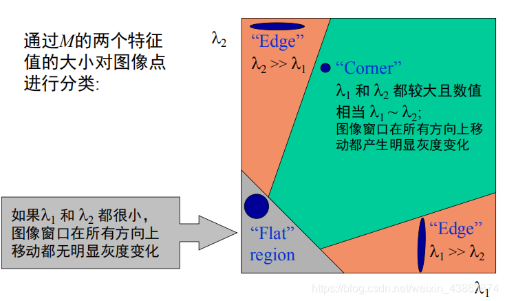

物理意义：

1. 当$λ₁$和$λ₂$都很小时，表示该区域灰度变化平缓，是**平坦区域**
2. 当$λ₁>>λ₂$或$λ₂>>λ₁$时，表示该区域在某一方向上有较大变化，是**边缘**
3. 当$λ₁$和$λ₂$都很大时，表示该区域在各个方向都有较大变化，是**角点**

从几何角度看：

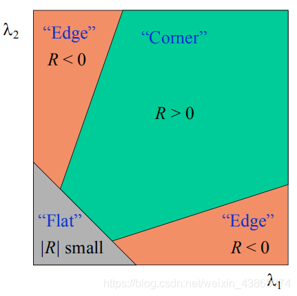

1. 矩阵$M$的特征值反映了局部区域在主方向上的灰度变化程度
2. 角点响应函数$R$的值反映了该点作为角点的显著程度：
   - $R > 0$ 表示可能是角点
   - $R < 0$ 表示可能是边缘
   - $|R| ≈ 0$ 表示可能是平坦区域

Harris角点检测具有以下特点：

- 旋转不变性：角点的检测不受图像旋转的影响
- 灰度变化不敏感：对图像灰度的线性变化具有鲁棒性
- 噪声抗干扰：通过高斯窗口函数可以抑制噪声影响

### SUSAN角点检测

SUSAN(Smallest Univalue Segment Assimilating Nucleus)角点检测算法是一种基于区域的特征检测方法。其基本思想是通过比较**局部圆形邻域内与中心点亮度相似的区域大小**来判断角点。

#### 基本原理

SUSAN算法在图像中使用一个圆形模板（称为USAN区域），比较模板中心点（称为核心点）与邻域内其他点的灰度值相似性。通过计算与核心点相似的区域大小（称为USAN面积）来判断该点是否为角点。

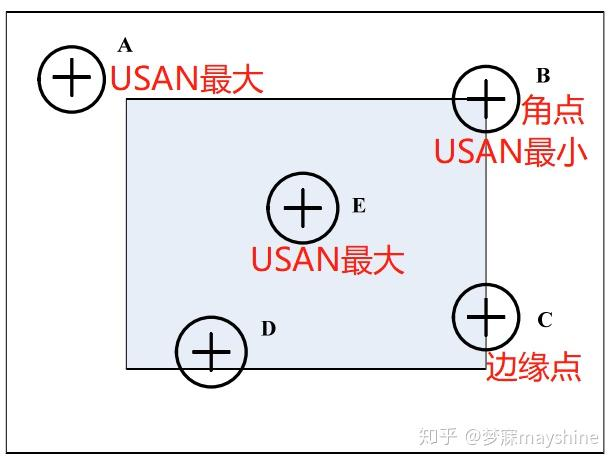

对于图像中的每个点$r_0$（核心点），计算其圆形邻域内每个点$r$与核心点的相似度：

$$
c(r,r_0) = \begin{cases}
1, & |I(r) - I(r_0)| \leq t \\
0, & |I(r) - I(r_0)| > t
\end{cases}
$$

其中：
- $I(r)$表示点$r$处的灰度值
- $t$是灰度差阈值
- $c(r,r_0)$是相似度比较函数

USAN面积计算：
$$
n(r_0) = \sum_{r \in S} c(r,r_0)
$$
其中$S$是以$r_0$为中心的圆形模板区域。

可以看到USAN面积反映了局部区域与中心点亮度相似的区域大小。这个区域越小，且越接近圆形，则该点越可能是角点。

#### 角点响应函数

SUSAN角点响应函数定义为：
$$
R(r_0) = \begin{cases}
g - n(r_0), & \text{if } n(r_0) < g \\
0, & \text{otherwise}
\end{cases}
$$

其中：
- $g$是几何阈值，通常取圆形模板面积的一半
- $n(r_0)$是USAN面积
- $R(r_0)$是角点响应值

通过计算每个像素点的$R(r_0)$值，然后设置一个阈值，如果$R(r_0)$值大于阈值，则该点为角点。

#### 物理意义和几何意义

物理意义：

1. 在平坦区域，USAN面积接近模板面积
2. 在边缘处，USAN面积约为模板面积的一半
3. **在角点处，USAN面积较小，通常小于模板面积的一半**

从几何角度理解：

1. USAN区域反映了局部区域的结构特征：
   - 平坦区域：USAN呈圆形，面积最大
   - 边缘处：USAN呈半圆形
   - 角点处：USAN呈扇形，面积最小
2. 圆形模板的使用使算法具有旋转不变性
3. 局部区域的亮度相似性判断使算法对噪声具有较强的鲁棒性

SUSAN角点检测的优点：
- 计算简单：只需要简单的灰度值比较
- 抗噪声能力强：使用局部区域统计特性

## 圆形度判断并排序

圆形度是描述目标区域与理想圆形相似程度的一个重要形状特征参数。在细胞计数应用中，通过圆形度判断可以有效识别和统计图像中的细胞数量。

### 基本原理

圆形度计算基于目标区域的面积和周长的关系。对于给定面积的图形，圆形具有**最小的周长**，这一特性可用于判断目标区域的圆形程度。

圆形度定义为：
$$
Circularity = \frac{4\pi \cdot Area}{Perimeter^2}
$$

其中：

- Area 是目标区域的面积
- Perimeter 是目标区域的周长
- 4π 是归一化因子

圆形度意义：

1. 对于完美的圆形，圆形度值为1
2. 对于任何非圆形，圆形度值小于1
3. 形状越不规则，圆形度值越小
4. 圆形度值范围在0到1之间

要确定图像中的圆形度，需要先提取目标区域，然后计算其面积和周长，最后使用圆形度公式计算圆形度。

对于细胞图像，细胞区域就是目标区域。圆形度检测前需要先进行图像的二值化，然后提取目标区域，计算其面积和周长，最后使用圆形度公式计算圆形度。

## 不变矩识别验证码中的数字

图像矩是描述图像全局特征的重要方法，不变矩具有旋转、缩放和平移不变性。

### 基本概念

#### 普通矩

对于图像$f(x,y)$，$(p+q)$阶矩定义为：
$$
m_{pq} = \sum_{x}\sum_{y} x^p y^q f(x,y)
$$

其中：

- $p,q = 0,1,2,...$
- $x,y$是像素坐标
- $f(x,y)$是像素灰度值

普通矩反映了图像的灰度分布和整体特征。对于一幅图像可以计算出多个普通矩。

#### 中心矩

为了获得**平移不变性**，使用中心矩：
$$
\mu_{pq} = \sum_{x}\sum_{y} (x-\bar{x})^p (y-\bar{y})^q f(x,y)
$$

其中：

- $\bar{x} = m_{10}/m_{00}$
- $\bar{y} = m_{01}/m_{00}$
- $(\bar{x},\bar{y})$是图像的质心，质心是图像的几何中心

#### Hu不变矩

Hu提出的七个不变矩是中心矩的特定组合，具有旋转、缩放和平移不变性：

$$
\begin{aligned}
\phi_1 &= \eta_{20} + \eta_{02} \\
\phi_2 &= (\eta_{20} - \eta_{02})^2 + 4\eta_{11}^2 \\
\phi_3 &= (\eta_{30} - 3\eta_{12})^2 + (3\eta_{21} - \eta_{03})^2 \\
\phi_4 &= (\eta_{30} + \eta_{12})^2 + (\eta_{21} + \eta_{03})^2 \\
\phi_5 &= (\eta_{30} - 3\eta_{12})(\eta_{30} + \eta_{12})[({\eta_{30} + \eta_{12}})^2 - 3(\eta_{21} + \eta_{03})^2] + \\
       &(3\eta_{21} - \eta_{03})(\eta_{21} + \eta_{03})[3(\eta_{30} + \eta_{12})^2 - (\eta_{21} + \eta_{03})^2] \\
\phi_6 &= (\eta_{20} - \eta_{02})[({\eta_{30} + \eta_{12}})^2 - (\eta_{21} + \eta_{03})^2] + \\
       &4\eta_{11}(\eta_{30} + \eta_{12})(\eta_{21} + \eta_{03}) \\
\phi_7 &= (3\eta_{21} - \eta_{03})(\eta_{30} + \eta_{12})[({\eta_{30} + \eta_{12}})^2 - 3(\eta_{21} + \eta_{03})^2] - \\
       &(\eta_{30} - 3\eta_{12})(\eta_{21} + \eta_{03})[3(\eta_{30} + \eta_{12})^2 - (\eta_{21} + \eta_{03})^2]
\end{aligned}
$$

其中$\eta_{pq}$是归一化中心矩：
$$
\eta_{pq} = \frac{\mu_{pq}}{\mu_{00}^{\gamma}}
$$
其中$\gamma = \frac{p+q}{2} + 1$

不变矩的物理意义：

- $\phi_1$：描述图像的质量分布
- $\phi_2$：描述图像的偏心程度
- $\phi_3,\phi_4$：描述图像的不规则性
- $\phi_5,\phi_6,\phi_7$：描述图像的更高阶特征

不变性的体现：

- 平移不变性：通过使用中心矩实现
- 尺度不变性：通过归一化实现
- 旋转不变性：通过特定的矩组合实现

# 实验过程及代码

## 角点检测

### Harris角点检测

本实验实现了Harris角点检测的两种方法，一种是手写实现，另一种是使用OpenCV实现。着重介绍手写实现的方法。

#### 核心实现过程

流程图：

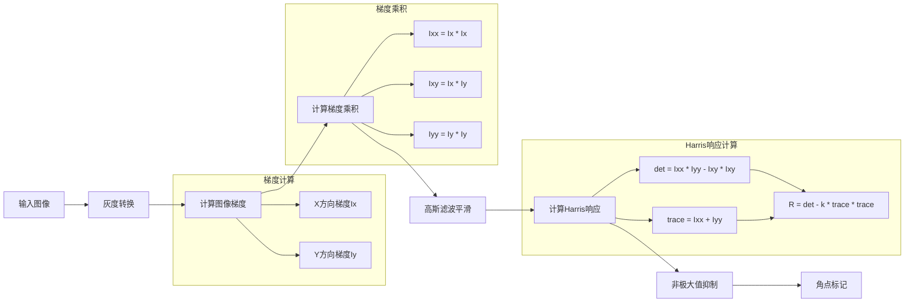

1. 图像预处理：

```python
# 转换为灰度图并转换为float32类型
if len(img.shape) == 3:
    gray = cv.cvtColor(img, cv.COLOR_BGR2GRAY)
    gray = np.float32(gray)
```

2. 计算图像梯度：

```python
# 使用Sobel算子计算x和y方向的梯度
kernel_x = np.array([[-1, 0, 1], [-2, 0, 2], [-1, 0, 1]], dtype=np.float32)
kernel_y = np.array([[-1, -2, -1], [0, 0, 0], [1, 2, 1]], dtype=np.float32)
Ix = cv.filter2D(gray, -1, kernel_x) # x方向梯度
Iy = cv.filter2D(gray, -1, kernel_y) # y方向梯度
```

3. 计算梯度乘积：

```python
# 计算梯度乘积
Ix2 = Ix * Ix
Iy2 = Iy * Iy
Ixy = Ix * Iy
```

4. 计算$M$矩阵：

```python
# 计算M矩阵
M = cv.filter2D(Ix2, -1, kernel_x) + cv.filter2D(Iy2, -1, kernel_y)
```

5. 计算角点响应函数$R$：

```python
# 计算Harris响应函数
det = Ixx * Iyy - Ixy * Ixy # 矩阵M的行列式
trace = Ixx + Iyy # 矩阵M的迹
harris_response = det - k * trace * trace # Harris响应
```

6. 非极大值抑制：

```python
# 设置阈值并进行非极大值抑制
threshold = harris_response.max() * 0.01
window_size = 3
corner_mask = np.zeros_like(harris_response, dtype=bool)
# 在3×3窗口内进行非极大值抑制
for i in range(window_size, rows - window_size):
    for j in range(window_size, cols - window_size):
        if harris_response[i, j] > threshold:
            window = harris_response[i-window_size:i+window_size+1,
                                    j-window_size:j+window_size+1]
            if harris_response[i, j] == window.max():
                corner_mask[i, j] = True
```

另外在UI中添加了**滑动条**，动态调整k值。

**关键参数：**

- k：Harris响应函数中的经验常数，通常取0.04-0.06
- threshold：角点响应阈值，这里取最大响应值的1%
- window_size：非极大值抑制的窗口大小
- sigma：高斯滤波的标准差

### SUSAN角点检测

本实验实现了SUSAN角点检测的手写版本，通过计算USAN面积和角点响应来检测角点。

#### 核心实现过程

流程图：

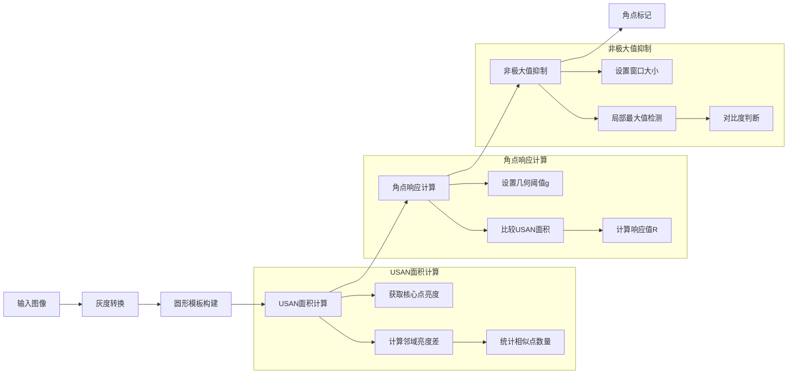

1. 圆形模板构建：

```python
# 创建圆形模板
radius = 3  # 模板半径
template = np.zeros((2*radius+1, 2*radius+1), dtype=bool)
y, x = np.ogrid[-radius:radius+1, -radius:radius+1]
mask = x*x + y*y <= radius*radius
template[mask] = True
```

2. USAN面积计算：

```python
# 计算USAN面积
nucleus = padded[i, j]  # 核心点亮度
neighborhood = padded[i-radius:i+radius+1, j-radius:j+radius+1]
diff = np.abs(neighborhood - nucleus)  # 亮度差
similar = (diff <= t)  # 相似点判断
area = np.sum(similar & template)  # USAN面积
```

3. 角点响应计算：

```python
# 计算角点响应
g = template_area * 0.3  # 几何阈值
if area < g:
    corner_response[i-radius, j-radius] = (g - area) / g
```

4. 非极大值抑制：

```python
# 非极大值抑制
if corner_response[i,j] > min_response:
    window = corner_response[i-window_size:i+window_size+1, 
                           j-window_size:j+window_size+1]
    if corner_response[i,j] == window.max():
        local_max = window.max()
        local_mean = window.mean()
        if local_max > 3.0 * local_mean:
            corner_mask[i,j] = True
```

**关键参数：**

1. 模板参数：
   - radius = 6：圆形模板半径
   - template_area：模板总面积

2. 检测参数：
   - t：亮度差阈值（可通过UI调节）
   - g = template_area * 0.3：USAN面积阈值
   - min_response = 0.7：最小响应阈值

3. 抑制参数：
   - window_size = 7：非极大值抑制窗口大小
   - local_contrast = 3.0：局部对比度要求

另外也是基于UI添加了滑动条，动态调整$t$也就是亮度差阈值。

由于opencv库中没有SUSAN角点检测的函数，所以主要是上述的手写实现。但是处理速度比较不理想。

基于SUSAN原理，还有一个**FAST角点检测**，这是opencv库中自带的函数，它也是通过判断类似的USAN面积来检测角点。本实验也实现了用FAST函数进行角点检测方法，处理速度块了很多。

## 圆形度判断并排序

本实验实现了基于圆形度的细胞计数功能，通过计算连通区域的圆形度来识别和统计图像中的细胞数量。

#### 核心实现过程

流程图：

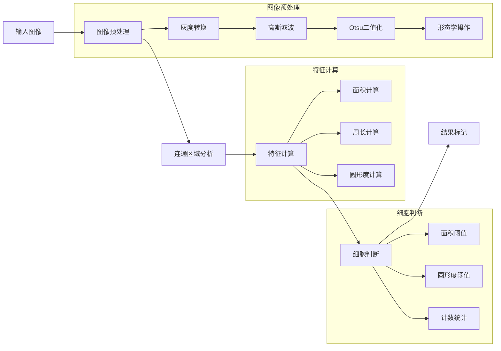

#### 2. 关键步骤实现

1. 图像预处理：
```python
# 高斯滤波去噪
blurred = cv.GaussianBlur(gray, (5, 5), 0)

# Otsu二值化
_, binary = cv.threshold(blurred, 0, 255, cv.THRESH_BINARY_INV + cv.THRESH_OTSU)

# 形态学操作
kernel = np.ones((3,3), np.uint8)
binary = cv.morphologyEx(binary, cv.MORPH_OPEN, kernel, iterations=2)
binary = cv.morphologyEx(binary, cv.MORPH_CLOSE, kernel, iterations=2)
```

2. 连通区域分析：
```python
# 连通区域标记
num_labels, labels, stats, centroids = cv.connectedComponentsWithStats(binary, connectivity=8)

# 遍历连通区域
for i in range(1, num_labels):  # 跳过背景(i=0)
    area = stats[i, cv.CC_STAT_AREA]
    if area < min_area or area > max_area:
        continue
```

3. 圆形度计算：
```python
# 获取轮廓
contours, _ = cv.findContours(mask, cv.RETR_EXTERNAL, cv.CHAIN_APPROX_SIMPLE)
contour = contours[0]

# 计算圆形度
perimeter = cv.arcLength(contour, True)
circularity = 4 * np.pi * area / (perimeter * perimeter) if perimeter > 0 else 0
```

4. 细胞标记：
```python
if circularity > threshold:
    cell_count += 1
    x = int(centroids[i][0])
    y = int(centroids[i][1])
    cv.drawContours(mark, [contour], -1, (0, 255, 0), 2)  # 绿色轮廓
    cv.circle(mark, (x, y), 3, (0, 0, 255), -1)  # 红色中心点
    cv.putText(mark, f'{cell_count}', (x-10, y-10), 
              cv.FONT_HERSHEY_SIMPLEX, 0.5, (255, 0, 0), 1)  # 蓝色编号
```

**关键参数：**

1. 预处理参数：
   - 高斯核大小：(5,5)
   - 形态学核大小：(3,3)
   - 形态学操作迭代次数：2

2. 判断参数：
   - min_area = 50：最小面积阈值
   - max_area = 5000：最大面积阈值
   - threshold = 0.7：圆形度阈值（可通过UI调节）

通过UI界面的滑动条，可以动态调整圆形度阈值，便于观察不同阈值下的细胞计数结果。

## 不变矩识别验证码中的数字

本实验实现了基于不变矩的数字识别功能，通过对图像去噪、数字定位、不变矩数字分割归一化之后，利用模板匹配，识别出验证码图片中的数字，参考matlab项目实现

#### 1. 核心实现流程

流程图：

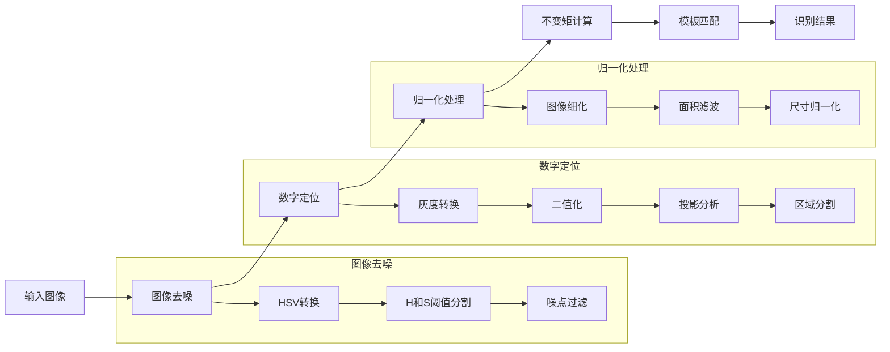

1. 图像去噪

``` matlab
Img = handles.Img;
% 颜色空间转换
hsv = rgb2hsv(Img);
h = hsv(:, :, 1);
s = hsv(:, :, 2);
v = hsv(:, :, 3);
bw1 = h > 0.16 & h < 0.30;
bw2 = s > 0.65 & s < 0.80;
bw = bw1 & bw2;
% 过滤噪音点
Imgr = Img(:, :, 1);
Imgg = Img(:, :, 2);
Imgb = Img(:, :, 3);
```

2. 数字定位

``` matlab
Imgbw = handles.Imgbw;
% 灰度化
Ig = rgb2gray(Imgbw);
% 二值化
Ibw = im2bw(Ig, 0.8);
% 常量参数
sz = size(Ibw);
cs = sum(Ibw, 1);  % 垂直投影
mincs = min(cs);
maxcs = max(cs);
masksize = 16;
Ibw = ~Ibw; % 图像反色
Ibw = bwmorph(Ibw, 'thin', inf); % 图像细化
Rect = cell(1, length(S1)); % 存储每个字符的边界框位置
for i = 1 : length(S1)
    Ibwi = Ibw(:, S1(i):E1(i)); % 图像裁剪
    [L, num] = bwlabel(Ibwi); % 连通区域标记
    stats = regionprops(L); % 获取积最大的连通区域
    Ar = cat(1, stats.Area);
    [maxAr, ind_maxAr] = max(Ar); % 获取积最大的连通区域
    recti = stats(ind_maxAr).BoundingBox; % 获取边界框
    recti(1) = recti(1) + S1(i) - 1;
    Rect{i} = recti;
    Ibwi = imcrop(Ibw, recti); % 裁剪并归一化到指定大小
    rate = masksize/max(size(Ibwi));
    Ibwi = imresize(Ibwi, rate, 'bilinear');
    ti = zeros(masksize, masksize);
    rsti = round((size(ti, 1)-size(Ibwi, 1))/2);
    csti = round((size(ti, 2)-size(Ibwi, 2))/2);
    ti(rsti+1:rsti+size(Ibwi,1), csti+1:csti+size(Ibwi,2)) = Ibwi; % 存储
    Ti{i} = ti;
end
```

3. 归一化处理

``` matlab
% 组合所有字符到一个图像中
for i = 1:length(Ti)
    % 获取当前字符图像并调整大小
    char_img = imresize(Ti{i}, [char_height char_width]);
    
    % 计算字符位置
    start_col = (i-1)*(char_width + spacing) + 1;
    end_col = start_col + char_width - 1;
    
    % 放置字符
    combined_image(:, start_col:end_col) = char_img;
end
```

4. 模板匹配识别

``` matlab
fileList = GetAllFiles(template_path); % 加载模板库中的所有模板图像
disp(['找到 ', num2str(length(fileList)), ' 个模板文件']);
Tj = [];
for i = 1 : length(fileList) % 对每个模板进行特征提取和比对
    filenamei = fileList{i};
    [pathstr, name, ext] = fileparts(filenamei);
    if isequal(ext, '.jpg')
        try
            ti = imread(filenamei); % 读取模板图像
            ti = im2bw(ti, 0.5); % 二值化
            ti = double(ti); % 转换为double类型
            phii = invmoments(ti); % 提取模板的不变矩特征
            OTj = [];
            for j = 1 : length(Ti)
                tij = double(Ti{j}); % 转换为double类型
                phij = invmoments(tij); % 提取待识别字符的不变矩特征
                ad = norm(phii-phij); % 计算特征距离
                otij.filename = filenamei;
                otij.ad = ad;
                OTj = [OTj otij];
            end
            Tj = [Tj; OTj];
        catch ME
            disp(['处理模板文件出错：', filenamei]);
            disp(['错误信息：', ME.message]);
        end
    end
end
% 识别结果
result = '';
for i = 1 : size(Tj, 2)
    ti = Tj(:, i);
    % 获取特征距离
    adi = cat(1, ti.ad);
    % 找到最小距离对应的模板
    [minadi, ind] = min(adi);
    filenamei = ti(ind).filename;
    % 从文件名中提取数字
    [pathstr, name, ext] = fileparts(filenamei);
    [~, folder, ~] = fileparts(pathstr);
    result = [result folder];
    disp(['第', num2str(i), '个字符识别结果：', folder]);
end
```

**关键参数：**

1. 去噪参数（HSV空间）：
   - H通道范围：0.16-0.30
   - S通道范围：0.65-0.80
   - 这个范围是经过实验确定的，可以有效过滤掉验证码中的彩色噪点

2. 数字定位参数：
   - 二值化阈值：0.8
   - 掩码大小：16×16
   - 投影阈值：maxcs（最大投影值）

3. 归一化参数：
   - 字符间距：20像素
   - 字符大小：50×50像素

4. 模板匹配参数：
   - 二值化阈值：0.5
   - 特征距离阈值：动态选择最小距离

**主要策略：**

- HSV颜色空间去噪：
   - H（色调）和S（饱和度）对光照变化不敏感，可以更准确地描述颜色特征，便于分离彩色噪点和黑色字符

- 投影法字符分割：
   - 垂直投影反映了每一列的像素累加值，字符区域的投影值较大，字符间隔的投影值较小，通过投影值的变化可以准确定位字符位置

- 不变矩在字符识别中的作用：
   - 平移不变性：字符位置的变化不影响识别
   - 旋转不变性：字符旋转后仍能识别
   - 尺度不变性：字符大小变化后仍能识别

- 模板匹配策略：
   - 计算待识别字符与所有模板的不变矩距离，选择距离最小的模板作为识别结果，距离越小表示匹配度越高

# 实验结果与分析

## 角点检测

处理时间：

| 算法          | 处理时间    |
| ------------- | ----------- |
| Harris手写    | 44-52ms     |
| Harris_OpenCV | 2-6ms       |
| SUSAN手写     | 1100-1250ms |
| SUSAN_FAST    | 2-7ms       |

### Harris角点检测

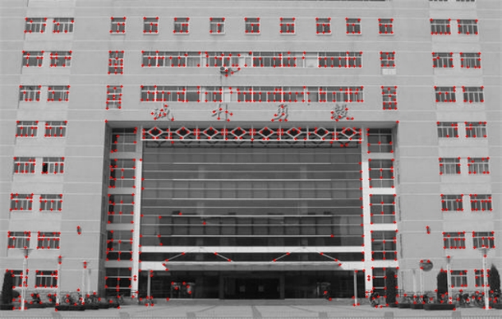

### SUSAN角点检测

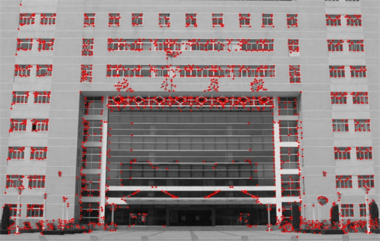

## 圆形度判断并排序

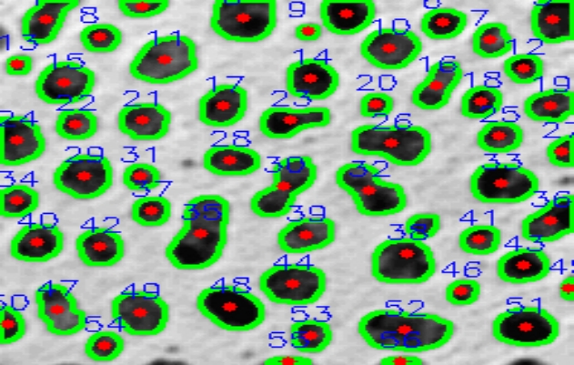

处理时间在3-5ms。

## 不变矩识别验证码中的数字

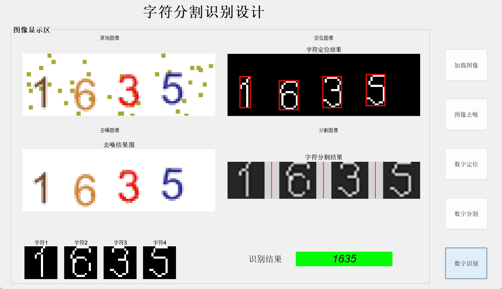

共297个模板文件，处理时间在5ms以内。

# 实验总结及心得体会

1. **角点检测算法的实现与优化**：
   - Harris角点检测中，高斯滤波的参数选择对结果影响很大。较大的sigma值会使角点检测更稳定但可能丢失细节，较小的sigma值则可能导致过多噪声点被误检为角点。
   - SUSAN角点检测我没有找到现成的函数，通过手动原理实现的功能效果还行，可以通过手动调整t值来调节检测效果，但是处理速度较慢，于是通过查阅网络资料发现FAST检测方法基本可以实现类似的效果。

2. **调参**：
   - Harris角点检测中的k值对检测结果影响很大，k值越大，检测到的角点越少，k值越小，检测到的角点越多。

     ```python
     harris_response = det - k * trace * trace
     ```

   - SUSAN检测中的亮度差阈值t和几何阈值g的选择直接影响检测效果，t越大，往往检测到的角点越少，t越小，检测到的角点越多；g作为几何阈值，g越大，往往检测的角点越少，g越小，检测的角点越多。

     ```python
     g = template_area * 0.3  # 几何阈值
     similar = (diff <= t)    # 亮度差判断
     ```

3. **细胞计数**：

   - 实现圆形度判断之后，通过UI界面调节圆形度阈值，可以直观观察到不同阈值下的细胞计数结果，便于选择合适的阈值。
   - 但是对于**正在分裂的两个细胞或者是两个粘连在一起很紧密的细胞**，圆形度判断的效果不是最好的，并且我尝试了使用分水岭算法把细胞分开计数，但是效果也不是很好。
   - 因此实际会出现有些有歧义的细胞，无法通过圆形度判断，就会算成是1个细胞。

4. **验证码识别**：
   - 不变矩特征在字符识别中表现出良好的旋转和尺度不变性。通过提取数字目标的**不变矩特征**，并利用**模板匹配**的方法，可以准确识别出验证码中的数字。
   - 降噪方法采用了HSV颜色空间，通过H和S通道的阈值分割，可以有效过滤掉彩色噪点。

通过本次实验，深入理解了图像特征提取和分析的基本原理，掌握了多种实用的图像处理技术。特别是在参数调节和算法优化方面获得了宝贵的实践经验。同时也认识到，在实际应用中需要根据具体问题选择合适的算法和参数，并注意算法的鲁棒性和计算效率。

